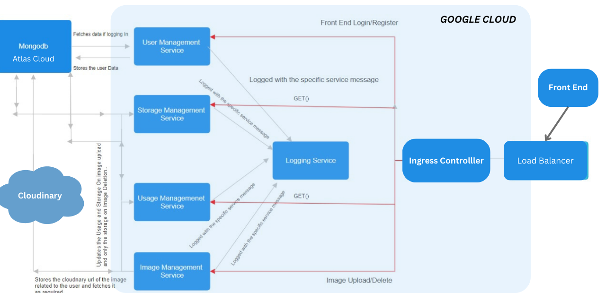
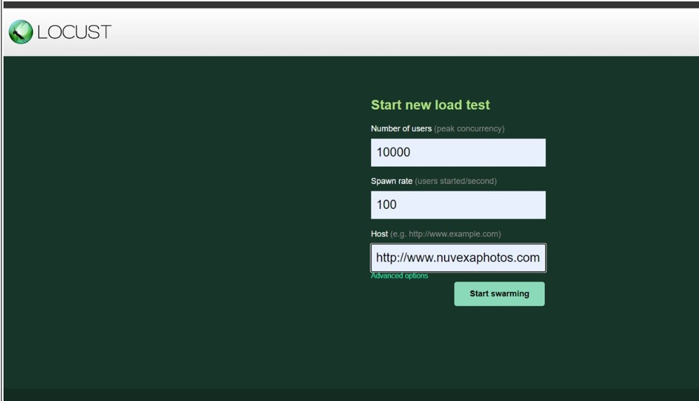
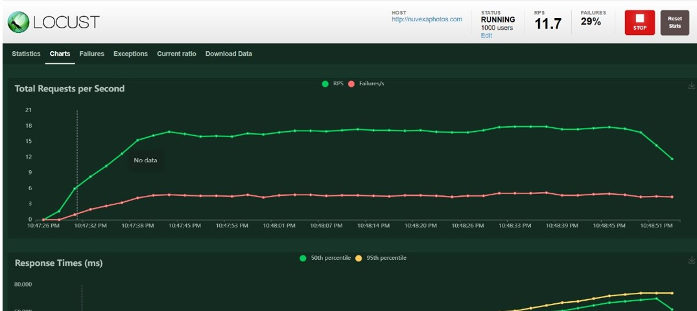

# Nuvexa-Photos
A web App based on Microservices Architecture for uploading and deleting pictures. This project is a full-stack application with a frontend built with React and a backend built with Node.js and Express.js. It's organized into several microservices, each with its own responsibilities, and uses MongoDB as the database. The project also includes Kubernetes configuration files for deploying the microservices.
### Login page

### Main Home page


## Architecture diagrams

## Overview Of Project Architecture

### Microservices Communication Architecture



## Deployment on GCP Kubernetes Cluster

The project is deployed on a Google Cloud Platform (GCP) Kubernetes Cluster.
The deployment of pods is configured using the Kubernetes cluster and outside traffic is handled using the Ingress controller.
### Overview of Cloud Architecture


## Structure

| Microservices Services| Description                                                  |
|-----------------------|--------------------------------------------------------------|
| Frontend              | Frontend application built with React.                       |
| FrontendService       | Handles the user interface and interactions.                 |
| LoggingService        | Collects logs whenever users update, delete, or add images. |
| UsageMngService       | Monitors daily transactions and usage, stores data on MongoDB Cloud Atlas. |
| StorageMngService     | Ensures that no user can upload more than 10MB of storage.    |
| PhotosMngService      | Stores all the photos on Cloudinary.                         |
| UserMngService        | Manages user data.                                           |

| Other Services               | Description                                                  |
|-----------------------|--------------------------------------------------------------|
| Kubernetes Configurations | Configuration files for deploying the services on Kubernetes.|
| Skaffold Configuration    | Configuration file for Skaffold, facilitating continuous development for Kubernetes applications.|
|Mongo DB |   All the users data and logging data is being stored in MongoDB Atlas                |
| Cloudinary                 | All the Images are being stored on cloudinary service|


## CI/CD Configuration

For Continuous Integration and Continuous Deployment (CI/CD), we are using Skaffold, a tool for streamlining the development workflow for Kubernetes applications.
### Skaffold in Architecture


## Deployment

The `.yaml` files in the `node/infra/k8s/` directory are used to create deployments of the microservices. Each running container of a microservice is contained in a pod, and each deployment that is affiliated with a pod has a cluster IP service through which they communicate. The `ingress.yaml` file configures the Ingress controller, which directs outward traffic from the browser to specific cluster IP services according to the endpoint.


### Build Process

Our CI/CD pipeline is configured with Skaffold to perform the following tasks:

1. **Building Docker Images:** Skaffold is set up to build Docker images for each microservice in this project.

2. **Continuous Integration:** We have integrated Skaffold into our CI workflow, ensuring that code changes trigger automated builds and tests.
   

### Deployment Process

### Prerequisites

1. **GCP Account:**
   - Create or log in to your Google Cloud Platform (GCP) account.

2. **Enable Kubernetes Cluster API:**
   - Enable the Kubernetes Cluster API before creating a cluster.

### Set Up GCP Terminal

```bash
# Install GCloud Terminal
gcloud auth login
gcloud init


# Choose option 1 to re-initialize the default configuration with new settings.
# Select your GCP account and project.
```

### Install Kubectl on GCP
```bash
gcloud components install kubectl
gcloud container clusters get-credentials <cluster-name>
```
### Google Cloud Build
#### 1. Enable Cloud Build:

Enable the Cloud Build service on GCP.
#### 2. Update Skaffold Configuration:

##### In infra/k8s/skaffol.yaml: <br>
Change projectId to your GCP project ID. <br>
Update the image field to match your project ID.

#### 3. Setup Ingress-Nginx:
You can Go to: 
<a href="https://www.kubernetes.github.io/ingress-nginx">Ingress controller documentation</a> <br>
and follow the steps to install the ingress controller but if you want to follow my commands they are given below. Commands change from time to time accordingly so you may have to refer to documentation.

Run: <br>
```bash
kubectl apply -f https://raw.githubusercontent.com/kubernetes/ingress-nginx/controller-v1.8.2/deploy/static/provider/cloud/deploy.yaml
```
* Verify pods are running:
``` bash
kubectl get pods --namespace=ingress-nginx

```
### Deploy Services with Skaffold

#### Restart Skaffold:

Stop any running Skaffold instances.

Run:

```bash
skaffold dev -v debug
```
* Skaffold will build images using Google Cloud Build, and images will be stored in the Google Cloud Repository.
* The above commands that we executed created 2 things for us. First it created Ingress controller and the oher one is Load balancer
#### Connect to Load Balancer:

* Find the Load Balancer IP address on GCP Networking Service > Load Balancer.
* Update your hosts file (e.g., c:\Windows\System32\Drivers\etc\hosts in Windows 10) to map the IP address to your domain (e.g., nuvexaphotos.com).
* add the ip address like :
  34.66.119.150 https://nuvexaphotos.com (e.g your load balancer ip address is 34.66.119.150 you will change it accordingly)
* All building processes are executed in Google Cloud Build, and the services will now be running on a remote virtual machine.

### Access Your Application:

Open your browser and go to ``` https://nuvexaphotos.com``` to access your running application.


## Load Testing

To ensure the scalability and performance of the microservices, load testing can be performed using [Locust](https://locust.io/), a Python-based load testing tool.

### Prerequisites

- Install Locust: `pip install locust`

### Running Load Tests

1. **Create a Locust file:**
   - Create a file named `locustfile.py` with appropriate test scenarios.

2. **Run Locust in your terminal:**
   ```bash
   locust -f locustfile.py
   ```
#### Screen Shots of the Load Testing are attached below:
 <br>
 <br>
 <br>
   
   
   * Note: Ensure that the load testing is performed in a controlled environment to avoid impacting the production system. Always monitor system performance during the test

