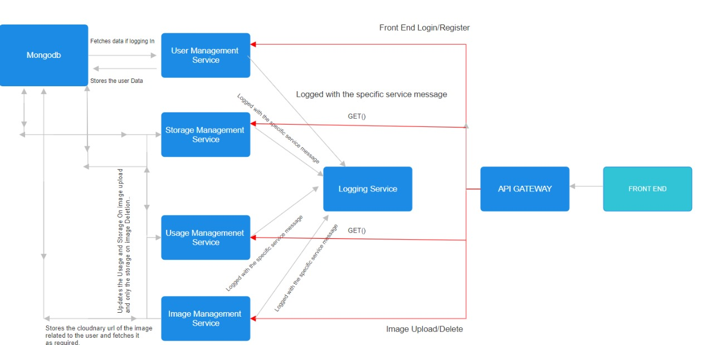

# Nuvexa-Photos
A web App based on Microservices Architecture for uploading and deleting pictures. This project is a full-stack application with a frontend built with React and a backend built with Node.js and Express.js. It's organized into several microservices, each with its own responsibilities, and uses MongoDB as the database. The project also includes Kubernetes configuration files for deploying the microservices.

## Table of Contents
- [Screenshots](#screenshots)
- [Architecture diagram of project](#architecture-diagram-of-project)
- [Overview](#overview)
  - [Deployment on GCP Kubernetes Cluster](#deployment-on-gcp-kubernetes-cluster)
- [Structure](#structure)
  - [Frontend](#frontend)
  - [FrontendService](#frontendservice)
  - [LoggingService](#loggingservice)
  - [UsageMngService](#usagemngservice)
  - [StorageMngService](#storagemngservice)
  - [PhotosMngService](#photosmngservice)
  - [UserMngService](#usermngservice)
  - [Kubernetes Configurations](#kubernetes-configurations)
  - [Skaffold Configuration](#skaffold-configuration)
- [Deployment](#deployment)
- [CI/CD Configuration](#cicd-configuration)
  - [Build Process](#build-process)
  - [Deployment Process](#deployment-process)
- [Getting Started](#getting-started)


## Architecture diagram of project



## Screenshots
#### login page

#### main upload page


### Deployment on GCP Kubernetes Cluster

The project is deployed on a Google Cloud Platform (GCP) Kubernetes Cluster.

## Structure

| Service               | Description                                                  |
|-----------------------|--------------------------------------------------------------|
| Frontend              | Frontend application built with React.                       |
| FrontendService       | Handles the user interface and interactions.                 |
| LoggingService        | Collects logs whenever users update, delete, or add images. |
| UsageMngService       | Monitors daily transactions and usage, stores data on MongoDB Cloud Atlas. |
| StorageMngService     | Ensures that no user can upload more than 10MB of storage.    |
| PhotosMngService      | Stores all the photos on Cloudinary.                         |
| UserMngService        | Manages user data.                                           |
| Kubernetes Configurations | Configuration files for deploying the services on Kubernetes.|
| Skaffold Configuration | Configuration file for Skaffold, facilitating continuous development for Kubernetes applications.|
|Cloudinary|All the Images are being stored on cloudinary service|

## Deployment

The `.yaml` files in the `node/infra/k8s/` directory are used to create deployments of the microservices. Each running container of a microservice is contained in a pod, and each deployment that is affiliated with a pod has a cluster IP service through which they communicate. The `ingress.yaml` file configures the Ingress controller, which directs outward traffic from the browser to specific cluster IP services according to the endpoint.

## CI/CD Configuration

For Continuous Integration and Continuous Deployment (CI/CD), we are using Skaffold, a tool for streamlining the development workflow for Kubernetes applications.

### Build Process

Our CI/CD pipeline is configured with Skaffold to perform the following tasks:

1. **Building Docker Images:** Skaffold is set up to build Docker images for each microservice in this project.

2. **Continuous Integration:** We have integrated Skaffold into our CI workflow, ensuring that code changes trigger automated builds and tests.

### Deployment Process

Skaffold facilitates the deployment of our microservices to a Kubernetes cluster. The deployment configuration is stored in the `skaffold.yaml` file.

To deploy the microservices locally, run the following command:

```bash
skaffold dev -v debug (please refer to other commands in skaffold documentation)
```


## Load Testing

To ensure the scalability and performance of the microservices, load testing can be performed using [Locust](https://locust.io/), a Python-based load testing tool.

### Prerequisites

- Install Locust: `pip install locust`

### Running Load Tests

1. **Create a Locust file:**
   - Create a file named `locustfile.py` with appropriate test scenarios.

2. **Run Locust in your terminal:**
   ```bash
   locust -f locustfile.py
   ```

